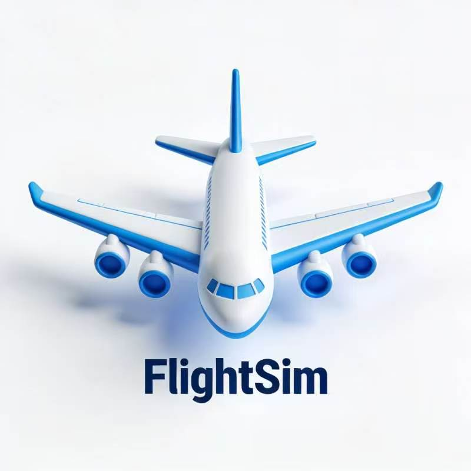

# A Online 3D Flight Simulator made by 飞的智动。

***
## Play On https://flystra.github.io/flightsim3d/
***
## Controls:
1. W nose down
2. S nose up
3. A turn left
4. D turn right
5. Arrow_Up speed up
6. Arrow_Down speed low
7. 1 change to view 1(Default view)
8. 2 change to view 2(Cockpit view)
9. 3 change to view 3(Right wing view)
10. 4 change to view 4(Gear view)
11. ESC pause game
12. R restart the game
13. Space Fire Missile (1.5s cooldown)
14. J Fire Flare (2.5s cooldown)
***
## Updates:

2.1V : Upadated shader. Added a new function of AI Battle.

2.0V : A major update. Beautify the UI. Modify moving and steering mechanism. Add shader. Add more HUD. Totally changed the gaming experience.

1.2v : Changed the textures, add some textures to the repository

1.1v : Fix bugs.

1.0v : First Formal Version. Added cloud, changed start menu.

0.2v : Change the textures

0.1v : First Released
